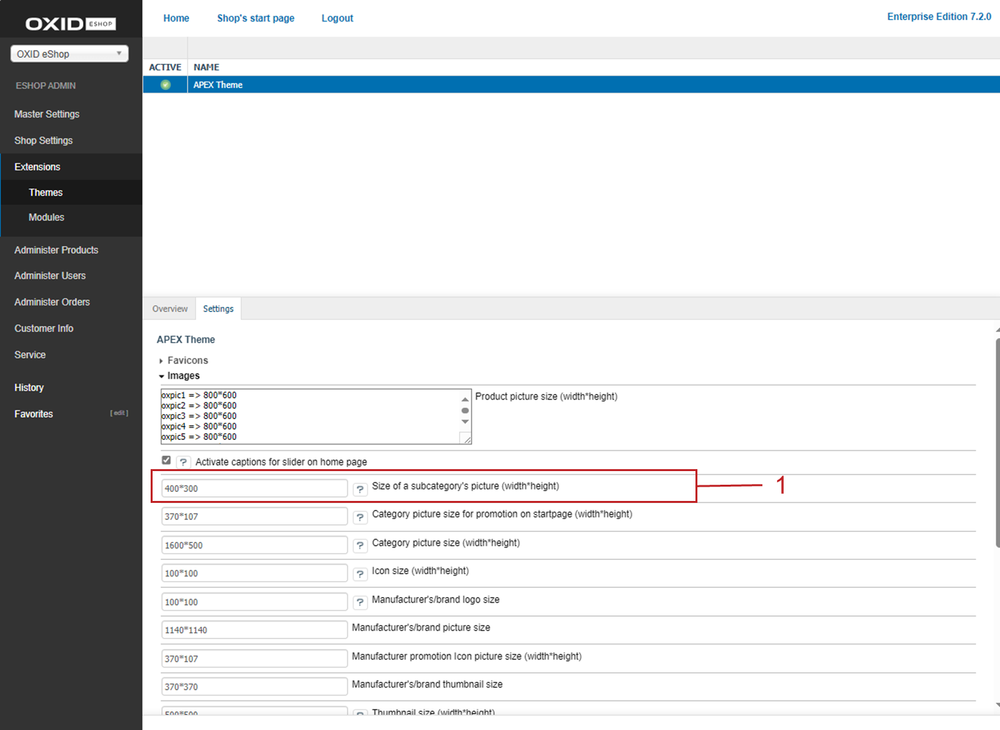
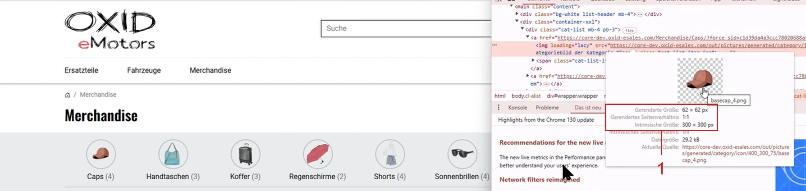

Images
======

Assign up to twelve product images to products, which are displayed in the detailed view of the product.

Items have zoom images that can also be called up on the detail page. Specify globally or at category level or for individual products which type of zoom you want to use.

Smaller item images show the item in the item lists, in product boxes and in the shopping cart. All required image types are generated automatically. To optimize page load speed and user experience, specify the maximum image size and image quality.

Specify whether order confirmations should be sent with images.

Specifying image generation and quality
---------------------------------------

The required settings for image generation and image sizes are made for all products in the administration area.

Displaying basic settings
^^^^^^^^^^^^^^^^^^^^^^^^^

If required, check the version of the software that is responsible for the dynamic creation of images.

|procedure|

1. Under :menuselection:`Master Settings --> Core Settings`, choose the :guilabel:`Settings` tab.
#. Choose :guilabel:`Pictures`.

   * Check the version of GDLib, the software on the server that generates graphics dynamically.
   * Check whether the automatic generation of icons is activated.

   Leave both settings unchanged.

Specifying the image quality
^^^^^^^^^^^^^^^^^^^^^^^^^^^^

If required, increase the speed at which pages are loaded in the browser.

|procedure|

1. Under :menuselection:`Master Settings --> Core Settings`, choose the :guilabel:`System` tab.
#. Choose the :guilabel:`Pictures` section.

   You have the following options:

   * :guilabel:`Picture Quality`: Specify the image quality when generating the images.

     The default setting is 75 and is a good compromise between image quality and file size.

     If the value is significantly lower, the product images are heavily compressed and therefore have a small file size, but poor image quality (blurring and compression artifacts).

     If the value is greater than 75, the image quality increases, but so does the size of the file (longer loading times).

   * :guilabel:`Automatically convert images to WebP format`: Increase the browser speed.

     To do so, automatically convert the images to WebP image format.

Sending order confirmations with pictures
-----------------------------------------

Decide whether order confirmations should include images.

|background|

E-mails with item images can quickly become large, which can lead to problems when sending and receiving the e-mails.

By default, e-mails are sent without item images.

The item images are loaded by the customer's mail program when the e-mail is read.

|procedure|

1. Under :menuselection:`Master Settings --> Core Settings`, choose the :guilabel:`System` tab.
#. Choose the :guilabel:`Pictures` section.
#. To send product images in the order confirmation, activate the :guilabel:`Send e-mails with inline Images` checkbox.

Optimizing image sizes
----------------------

To optimize the speed at which pages are loaded, set the smallest possible image sizes. Your images are then scaled down to this maximum image size before loading by the browser.

The actual :emphasis:` displayed` size of the images for products and categories as well as the manufacturer and brand logos depends on the design of your OXID eShop. You define these values with your CSS.

|example|

In our demo store, the images for displaying subcategories (:ref:`oxbaaz03a`) are downsized to a size of 400x300 pixels (:ref:`oxbaaz04`, item 1). This is the size that the browser would download on the end device.

.. _oxbaaz04:

   Fig.: Example: Set maximum image size 400x300 pixels

The stylesheet in turn reduces the image to 62x62 pixels. This is the actual displayed (rendered) size compared to the intrinsic size of the image downloaded by the browser (:ref:`oxbaaz05`, item 1).

The displayed intrinsic size of 300 x 300 pixels differs from the maximum size because it is a square image. In this case, the system uses the smallest side length as a basis, i.e. 300 pixels in this example.

.. _oxbaaz05:

   Fig.: Rendered image size 62x62 pixels in the stylesheet

|procedure|

1. Under :menuselection:`Extensions --> Themes`, choose the theme.
#. Choose the :guilabel:`Settings` tab and choose :guilabel:`Images`.

   You have the following options for adjusting the image sizes:

   * :guilabel:`Product picture size (width*height)`

     Product image that is displayed on the detail page.

     Define the maximum size of up to 12 product images.

     This allows product images of different sizes.

     For each product image there is a line at the beginning of which is ``oxpic`` and a number. ``oxpic1`` stands for the first product picture, ``oxpic2`` for the second product picture and so on.

     .. hint:: Use different image sizes with caution.

        Product images of different sizes could possibly lead to a rather unprofessional-looking presentation of the products.

   * :guilabel:`Size of a subcategory's picture (width*height)`.

     Image for displaying subcategories in the category overview.

     Name of the function: ``category.getIconUrl``
     |br|
     Name of the parameter: ``CatIconsize``
     |br|
     Default size: 400 pixels wide and 300 pixels high.

     .. _oxbaaz03a:

     .. figure:: ../media/screenshots/oxbaaz03a.png
        :alt: Category image of a subcategory
        :width: 650
        :class: with-shadow

        Fig.: Category image of a subcategory

   * :guilabel:`Category picture size for promotion on startpage (width*height)`

     Image for displaying the category overview. This image type is currently not used, but is retained to ensure downward compatibility, to enable future use and to allow you to integrate it into your own templates if required.

     Name of the function: ``category.getPromotionIconUrl``
     |br|
     Name of the parameter: ``CatPromotionsize``
     |br|
     Default size: 370 pixels wide and 107 pixels high.

   * :guilabel:`Category picture size (width*height)`

     Image of the category that is advertised on the start page.

     This image type is not used in the current demo data. However, it is part of the APEX theme and can be used at any time (example: :ref:`oxbaaz03c`).

     Name of the function: ``category.getThumbUrl``
     |br|
     Name of the parameter: ``sCatThumbnailsize``
     |br|
     Default size: 1600 pixels wide and 500 pixels high.

     .. _oxbaaz03c:

     .. figure:: ../media/screenshots/oxbaaz03c.png
        :alt: Category image
        :width: 650
        :class: with-shadow

        Fig: Category picture

   * :guilabel:`Icon size (width*height)`

     Icons are the smallest product images. They are used

     * in the shopping cart preview (minibasket) (:ref:`oxbaaz03d`, item 1)
     * in the shopping cart (:ref:`oxbaaz03d`, item 2)
     * as an image switcher (:ref:`oxbaaz03d`, item 3)
     * as image switcher for the modal zoom
     * for the size of the gift box

     Name of the function: ``article.getIconUrl``
     |br|
     Name of the parameter: ``sIconsize``
     |br|
     Default size: 100 pixels wide and 100 pixels high.

     .. _oxbaaz03d:

     .. figure:: ../media/screenshots/oxbaaz03d.png
        :alt: Icon in various functions
        :width: 650
        :class: with-shadow

        Fig.: Icon in various functions

   * :guilabel:`Manufacturer's/brand logo size`

     Logo that is displayed

     * in the brand overview on the start page (:ref:`oxbaaz03e`, item 1)
     * in the product overview per manufacturer (:ref:`oxbaaz03e`, item 1)
     * on the product detail page (:ref:`oxbaaz03e`, item 1)

     Name of the function: ``vendor.getIconUrl``
     |br|
     Name of the parameter: ``ManufacturerIconsize``
     |br|
     Default size: 100 pixels wide and 100 pixels high.

     .. _oxbaaz03e:

     .. figure:: ../media/screenshots/oxbaaz03e.png
        :alt: Manufacturer/brand logo in various functions
        :width: 650
        :class: with-shadow

        Fig.: Manufacturer/brand logo in various functions

   * :guilabel:`Manufacturer's/brand picture size`

     This image type is currently not used, but is retained to ensure downward compatibility, to enable future use and to allow you to integrate it into your own templates if required.

     Name of the function: ``manufacturer.getPictureUrl``
     |br|
     Name of the parameter: ``ManufacturerPicturesize``
     |br|
     Default size: 1140 pixels wide and 1140 pixels high.

   * :guilabel:`Manufacturer promotion Icon picture size (width*height)`

     This image type is currently not used, but is retained to ensure downward compatibility, to enable future use and to allow you to integrate it into your own templates if required.

     Name of the function: ``manufacturer.getPromotionIconUrl``
     |br|
     Name of the parameter: ``ManufacturerPromotionsize``
     |br|
     Default size: 370 pixels wide and 107 pixels high

   * :guilabel:`Manufacturer's/brand thumbnail size`

     This image type is currently not used, but is retained to ensure backward compatibility, to enable future use and to allow you to integrate it into your own templates if required.

     Name of the function: ``manufacturer.getPromotionIconUrl``
     |br|
     Name of the parameter: ``ManufacturerThumbnailsize``
     |br|
     Default size: 370 pixels wide and 370 pixels high

   * :guilabel:`Thumbnail size (width*height)`

     Thumbnails are preview images and are displayed wherever products are listed, for example in

     * Product comparison pages
     * Item lists, such as category overviews and search results
     * Promotions (example: Just arrived!)

     They can appear in grid view (:ref:`oxbaaz03i`, item 1) or list view (:ref:`oxbaaz03i`, item 2).

     Name of the function: ``article.getThumbnailUrl``
     |br|
     Name of the parameter: ``Thumbnailsize``
     |br|
     Default size: 500 pixels wide and 500 pixels high.

     .. _oxbaaz03i:

     .. figure:: ../media/screenshots/oxbaaz03i.png
        :alt: Thumbnails in grid and list view
        :width: 650
        :class: with-shadow

        Fig.: Thumbnails in grid and list view

   * :guilabel:`Zoom picture size (width*height)`

     Enlarged display of modal product images that can be called up on the detail page.

     Name of the function: ``article.getZoomPictureUrl``
     |br|
     Name of the parameter: ``ZoomImageSize``
     |br|
     Default size: 1200 pixels wide and 1200 pixels high.

.. Intern: oxbaaz, Status: